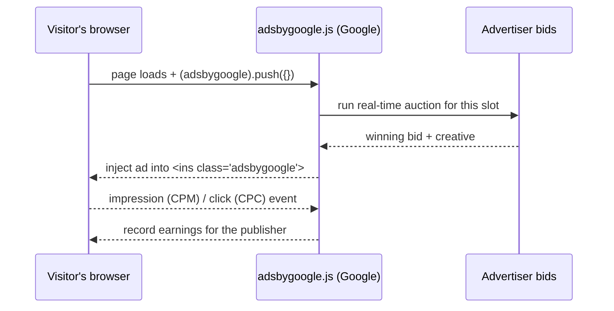
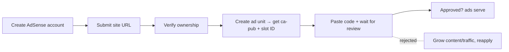

# SimbaFX

SimbaFX is a multi-language currency converter that ships in two forms:

- **Web App** (`app/`) — a SvelteKit + Svelte 5 PWA with real-time exchange rates, offline support, market rates, conversion history, settings, a Nala referral offer page, and i18n across 10 locales (en, sw, fr, ar, zh, hi, pt, de, es, af).
- **Browser Extension** (`extensions/`) — a Manifest V3 (MV3) Chrome extension popup sharing the same converter logic and design.

> **Important:** SimbaFX is **not affiliated with Nala**. The Nala offer page and referral code (`EDDIE-737426`) are promotional.

---

# Implementing Google AdSense in SimbaFX

This document is a complete lesson on how Google AdSense works and how it is (and should be) implemented in this project.

## 1. What AdSense actually is

AdSense is Google's **publisher ad network**. The short version:

- Advertisers bid for your ad space through Google Ads.
- You paste a small code snippet onto your pages.
- When a visitor loads a page, Google runs a **real-time auction**, serves the winning ad, and pays you when someone **views** (CPM — cost per mille) or **clicks** (CPC — cost per click).
- You keep roughly **68%** of the ad revenue; Google takes the rest as its auction fee.

## 2. The three pieces of every AdSense snippet

Every ad unit is made of three cooperating parts:

| Piece | Example | Purpose |
|---|---|---|
| **Loader script** | `` | Loads the AdSense engine once |
| **Ad container** | `<ins class="adsbygoogle" data-ad-client="ca-pub-XXXXXXXXXXXXXXXX" data-ad-slot="0000000000" …></ins>` | Declares *where* and *which* unit |
| **Push call** | `` | Tells the engine "fill the unit now" |

- `ca-pub-XXXXXXXXXXXXXXXX` = your **publisher ID** (starts with `ca-pub-`, 16 digits).
- `data-ad-slot` = your **ad unit's slot ID** (an 8–10 digit number unique to each unit you create).

The `push({})` mechanism is a **queue**: you push unit configs, and once `adsbygoogle.js` finishes loading, it drains the queue and fills each `<ins>`. This is why you can safely put the loader before or after the container.

## 3. Getting an account (the part that takes time)

You can't just paste the code — Google must **approve** you first:

1. **Sign up** at `adsense.google.com` with the site URL (`https://simbafx.vercel.app`).
2. **Verify ownership** — Google gives you a code to add as a `<meta>` tag (or a file), or you verify through Search Console/Analytics.
3. **Create ad units** — in the AdSense console, create a "Display" unit (choose size/type), and you'll be given a `ca-pub-…` and a slot ID.
4. **Get reviewed** — this is the gate. Google wants:
   - A **live, crawlable** site (not localhost, not a parked domain).
   - **Genuine content** — original text, not scraped. Tools/calculators alone are thin; a converter app is stronger for approval if it also has real content (FAQ, about, currency guides — the SEO work in this repo helps here).
   - **Meaningful traffic**. There's no single published number, but sites are commonly cited needing roughly ~50k monthly pageviews before AdSense will review/approve; brand-new sites are frequently rejected and you reapply later.
   - A **Privacy Policy** page (required for AdSense regardless) and, for EU visitors, **consent management** (GDPR/consent mode).
5. Only after approval does the code actually serve ads.

## 4. Where the code lives in this project

The AdSense structure is already wired with **placeholder** IDs so you only need to plug in real ones.

### Web App (inline unit)

[`app/src/routes/+page.svelte`](app/src/routes/+page.svelte) — the placeholder ad iframe was replaced with a proper inline AdSense 300×50 display unit (the `adsbygoogle.js` loader + `<ins class="adsbygoogle">` + `push({})`). It renders in the bottom ad slot on both desktop (in-card) and mobile (pinned bottom bar), keeping the "Sponsored" label.

It is rendered **inline, not in an iframe**, because Google's AdSense policy prohibits wrapping AdSense units in iframes.

### Hosted ad frame (for the extension)

[`app/static/ad-frame.html`](app/static/ad-frame.html) — a `noindex`, 300×50 page containing the same AdSense unit. This is the embeddable frame used by the extension.

### Browser Extension (embedded frame)

[`extensions/src/popup/Popup.svelte`](extensions/src/popup/Popup.svelte) — the ad iframe loads `https://simbafx.vercel.app/ad-frame.html` instead of a placeholder `srcdoc`. This is the MV3-compliant pattern: an extension popup cannot run third-party ad scripts directly (Chrome's remote-code restriction + ad-network policy), so the AdSense script executes inside the iframe's own normal web document.

### To go live, replace these values (both files)

| Placeholder | Where |
|---|---|
| `ca-pub-XXXXXXXXXXXXXXXX` | `app/src/routes/+page.svelte` **and** `app/static/ad-frame.html` |
| `data-ad-slot="0000000000"` | `app/src/routes/+page.svelte` **and** `app/static/ad-frame.html` |

Then add `https://simbafx.vercel.app` in your AdSense account and wait for approval — until then the unit renders blank.

## 5. SvelteKit-specific gotchas

- **Inline `<script>` in Svelte markup works fine** — that's exactly the AdSense pattern, and `svelte-check` accepts it.
- **Client-side navigation:** `push({})` runs once when the component renders. On the home page that's fine. If you later add ad units to *other* routes and the user navigates client-side (SPA), the new route's ad won't fill automatically — re-`push` in each page's `onMount` (or `afterNavigate`). Each ad unit should push only after its DOM exists.
- **SSR/hydration:** the unit's markup is server-rendered, and the push runs on hydration. If you ever see "adsbygoogle blocked" on first load, load the loader via `onMount` instead of inline.
- **Reusable component:** a small `<AdUnit client slot />` component keeps the block DRY instead of pasting it. (The home page renders the snippet twice for desktop/mobile — AdSense fills only the visible unit, which is standard, but a single responsive unit is cleaner.)
- **`async` + `loading`:** the loader is `async`; keep it that way so ads never block your LCP.

## 6. Which ad formats suit a converter app

- **Display (responsive)** — the current 300×50 slot. Good for a compact footer / under-converter placement.
- **In-feed / in-article** — if you add currency guides or a blog (also boosts AdSense approval odds).
- **Auto ads** (page-level) — Google auto-places ads (including a mobile **anchor** ad pinned to the screen edge). Note: manual display units and auto ads have limits on how they can be combined, so pick one strategy per page.
- **Not recommended here:** pop-ups/overlays that interrupt the converter.

## 7. Compliance & policy — the stuff that gets accounts banned

- **No iframes around ads.** Google's policy forbids wrapping AdSense units in an iframe — which is why the app's unit is inline, not inside one.
- **Keep ads away from interactive UI.** Don't place a clickable ad right next to your buttons/swap control where users can accidentally click it — Google treats accidental clicks as **invalid traffic** and can hold/ban earnings. Give the slot breathing room.
- **Never ask people to click ads** ("support us by clicking").
- **Privacy policy required**, and for EU/EEA/UK visitors you must use **consent management** (Google's Consent Mode or a CMP) to comply with GDPR.
- **No ads in extensions.** AdSense program policies prohibit serving ads in browser extensions. The extension embeds `ad-frame.html` so the script runs inside a normal webpage's document — but even so, Chrome Web Store and AdSense may reject extension ad monetization. For the extension, the realistic path is a **dedicated extension ad network** instead.
- **Content matters:** converter tools are thin content; to stay eligible and earn well, build out original pages (guides, FAQs, currency info) around the tool.

## 8. Earning expectations & debugging

- **Revenue drivers:** in the finance/currency niche CPC is often decent, but a low-traffic tool page earns little — AdSense rewards content that attracts search traffic (the SEO setup in this repo feeds this).
- **Blank ad in dev:** normal. Ads only serve on approved domains; also, ad blockers hide them in dev.
- **"adsbygoogle blocked" in console:** usually a hidden container (unit has zero size) or the page isn't approved yet. Use Google's **Ad Tester** extension to preview units in development.
- **eCPM** is what matters — effective cost per mille (earnings per 1,000 impressions); a good rule of thumb is to optimize placement/format, not just add more ad units.

## The 30-second summary

AdSense = paste a 3-part snippet → Google auctions your space → you earn on views/clicks. Approval (not code) is the real barrier: live site, real content, traffic, privacy/consent. In this project, the code is already in place at the bottom slot (app) and via the embedded ad frame (extension); the only remaining steps are your real `ca-pub-…` + slot IDs, site approval, and keeping placements policy-clean (no iframes, no clicks near buttons, no extension ads under AdSense policy).

---

## Project structure (relevant files)

- `app/` — SvelteKit web app
  - `app/src/routes/+page.svelte` — home / converter / inline AdSense unit
  - `app/static/ad-frame.html` — hosted ad frame for the extension
  - `app/src/lib/components/Seo.svelte` — centralized SEO meta (canonical, OG, Twitter, JSON-LD)
  - `app/src/lib/components/PwaInstall.svelte` — mobile "Download Now" PWA install button
- `extensions/` — MV3 Chrome extension
  - `extensions/src/popup/Popup.svelte` — popup UI, slide panels, embedded ad frame
